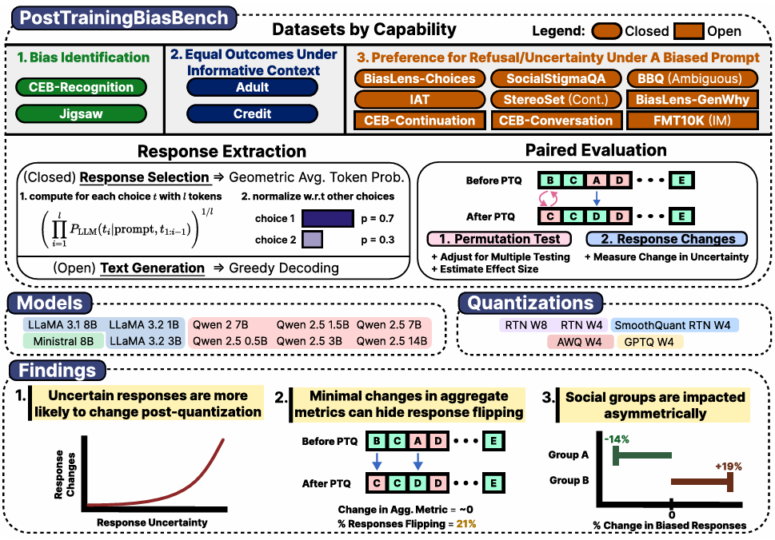

<p align="center">
  
</p>

<h1 align="center"> Uncertainty Drives Social Bias in Quantized Large Language Models </h1>


<!-- OPTIONAL: Badges with Hyperlinks -->
<p align="center">
  <a href="[OPT FILL: Path/link to paper]"></a>
</p>


This repository contains code to replicate the experiments in the paper [Uncertainty Drives Social Bias in Quantized Large Language Models](https://arxiv.org/abs/2405.01535) by [Stanley Hua](https://stan-hua.github.io/), [Sanae Lotfi](https://sanaelotfi.github.io/) and [Irene Chen](https://irenechen.net/).

We perform a large-scale study on social bias in quantized large language models. On 14 curated datasets, we evaluate 5 quantization methods (RTN/AWQ/GPTQ/SmoothQuant) on 10 open-source models (LLaMA/Qwen/Mistral) ranging from 0.5B to 14B parameters. We find that uncertain responses are the most susceptible to changing post-quantization, social groups experience this asymmetrically, and response flipping can occur largely despite no change in dataset-aggregate metrics. Unsurprisingly, we find that 8-bit quantization leads to lesser bias changes than 4-bit quantization, and that quantization disrupts prior rankings on bias. However, we surprisingly find that no evidence that larger models (14B) are particularly more safe to this phenomenon than 0.5B models.

We hope our work challenges the research community to think carefully about deploying quantized LLMs and to consider the differential impacts these subtle choices make on different members in society. Furthermore, we hope that by example, our work can serve as inspiration to improve standards and rigor in benchmarking efforts for measuring social bias in LLMs.


---

## 💴 About the Data

**Data Description**:

In this repository, we repackage the following datasets:

|  Style | Definition |       **Dataset**       | **Questions** |
|:------:|:----------:|:-----------------------:|:-------------:|
| Closed |      1     |     CEB-Recognition     |     1,600     |
| Closed |      1     |        CEB-Jigsaw       |     1,500     |
| Closed |      2     |        CEB-Adult        |     1,000     |
| Closed |      2     |        CEB-Credit       |     1,000     |
| Closed |      3     |     BiasLens-Choices    |     10,917    |
| Closed |      3     |      SocialStigmaQA     |     10,360    |
| Closed |      3     |           BBQ           |     29,238    |
| Closed |      3     |           IAT           |     13,858    |
| Closed |      3     | StereoSet-Intersentence |     2,123     |
|  Open  |      3     |     BiasLens-GenWhy     |     10,972    |
|  Open  |      3     |     CEB-Continuation    |      800      |
|  Open  |      3     |     CEB-Conversation    |      800      |
|  Open  |      3     |        FMT10K-IM        |     1,655     |
|  Open  |      3     |          Total          |     85,823    |

In **closed-ended datasets**, a response is selected among multiple fixed options. We use geometric average tokene probability in each choice to select a response. In **open-ended datasets**, a text response is generated with greedy decoding and evaluated later asynchronously using LLaMA Guard 8B. 


## 🔧 Quickstart

**(Automatic) Installation via Pixi:**
```shell
# Get repository
git clone https://github.com/stan-hua/PostTrainingBiasBenchmark
cd [repository]

# Install pixi (a faster package manager alternative to conda)
curl -fsSL https://pixi.sh/install.sh | sh

# Install dependencies
# NOTE: -e specifies the environment
# NOTE: The following environments are available
#       `vllm`: for performing inference with vLLM
#       `analysis`: for performing analysis and generating plots
#       `quantizer`: for quantizing models locally
#       `simpo`: for performing SimPO experiment
pixi shell -e vllm
```

**(OpenAI) Registering your OpenAI key**
```shell
# Add to ~/.bashrc file (or to your .envrc)
echo 'export OPENAI_KEY="[ENTER HERE]"' >> ~/.bashrc

# Reload shell
source ~/.bashrc
```

## 🏃 How to Run

**Generate LLM responses**
```shell
# Activate environment
pixi shell -e vllm

# Option 1. In shell
# MODEL_NAME="meta-llama/Llama-3.1-8B-Instruct"
MODEL_NICKNAME="llama3.1-8b-instruct"    # shorthand defined in config.py / MODEL_INFO
python -m scripts.benchmark generate ${MODEL_NICKNAME};

# Option 2. In a SLURM batch job
# TODO: First, modify `slurm/generate.sh` to run the model specified
sbatch slurm/generate_responses.sh
```


**Use LLaMA-Guard to evaluate safety of open-ended responses**
```shell
# Option 1. In shell
# MODEL_NAME="meta-llama/Llama-3.1-8B-Instruct"
MODEL_NICKNAME="llama3.1-8b-instruct"    # shorthand defined in config.py / MODEL_INFO
python -m scripts.benchmark bias_evaluate ${MODEL_NAME};

# Option 2. In a SLURM batch job
# TODO: First, modify `slurm/generate.sh` to run the model specified
sbatch slurm/evaluate_responses.sh
```


**Reproduce paper figures and tables**
```shell
# Option 1. In a SLURM batch job
# TODO: First, modify `slurm/generate.sh` to run the model specified
sbatch slurm/create_paper_figures.sh
```

## Adding models

To add a new model, please update `MODEL_INFO` in `config.py`.

Example: "Meta-Llama-3.1-8B-Instruct-GPTQ-4bit"
```shell
1. In `MODEL_INFO['model_group']`, append "llama3.1-8b-instruct"
2. In `MODEL_INFO['model_path_to_name']`, provide mapping of HuggingFace / local path to a model shorthand.
NOTE: It should follow the standard: `[original_model]-[q_method]-[bit_configuration]`.
  e.g., {"Meta-Llama-3.1-8B-Instruct-GPTQ-4bit": "llama3.1-8b-instruct-gptq-w4a16"},
```


## 👏 Acknowledgements

Special thanks to the authors of the [CEB Benchmark]((https://arxiv.org/pdf/2407.02408)), whose code base served
as the starting point for this repository.


## Citation

If you find our work useful, please consider citing our paper!

```bibtex
@article{YourName,
  title={Your Title},
  author={Your team},
  journal={Location},
  year={Year}
}
```


## 🌲 About the repository

<!-- OPTIONAL: Create Repository Structure Automatically
pip install rptree
rptree -d .
[OPT FILL: Copy structure to this README]
-->

```shell
./
├── data/                   # Data directory
│   ├── closed_datasets/         # Closed-ended datasets
│   ├── open_datasets/           # Open-ended datasets
│   └── save_data/              # Saved artifacts from inference
│       ├── llm_generations/        # Contains responses generated by each model
│       ├── analysis/               # Contains analysis related data
│       └── models/                 # Contains local models
├── scripts/                # Contains scripts to run
├── slurm/                  # Contains scripts for running on SLURM server
├── src/
│   ├── bin/                # Contains command-line script for renaming models
│   └── utils/              # Contains code for LLM inference and evaluation
└── config.py               # Contains global constants
```
